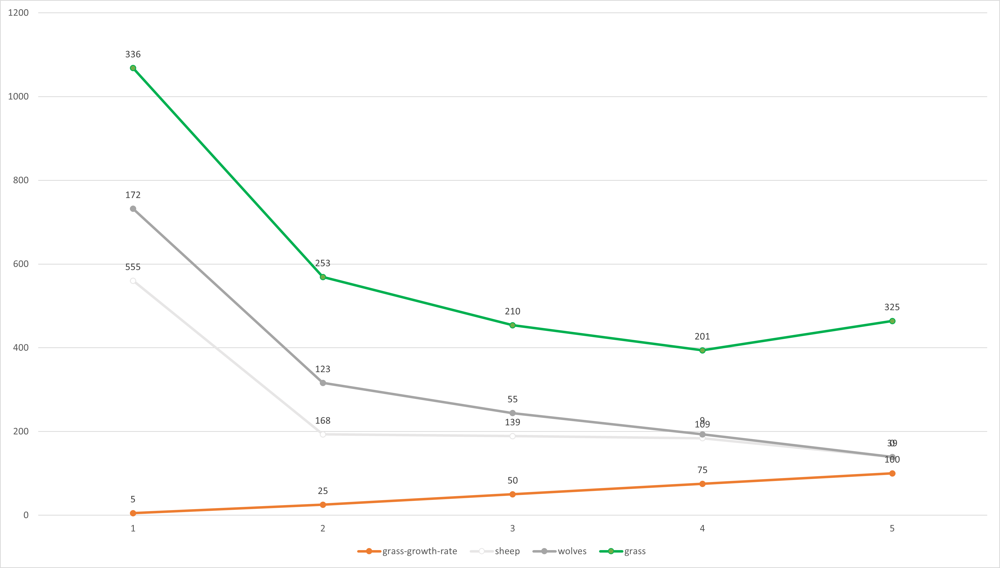

## Комп'ютерні системи імітаційного моделювання
## СПм-22-6, **Соробей Богдан Володимирович**
### Лабораторна робота №**1**. Опис імітаційних моделей та проведення обчислювальних експериментів

 

### Варіант 7, Wolf Sheep Predation. Модель взаємоіснування хижаків та їх жертв. Модель у середовищі NetLogo:
[Wolf Sheep Predation](http://www.netlogoweb.org/launch#http://www.netlogoweb.org/assets/modelslib/Sample%20Models/Biology/Wolf%20Sheep%20Predation.nlogo)

 

## Вербальний опис моделі:
Дана модель досліджує стабільність екосистеми «хижак-жертва». Система вважається нестабільною, якщо в ній спостерігається тенденція до вимирання одного чи кількох видів. З іншого боку, стабільна система прагне забезпечити своє існування протягом тривалого часу, незалежно від коливань чисельності населення.

### Є два основних сценарії цієї моделі:
У першому сценарії, відомому як «вівці-вовки», вовки та вівці випадково блукають ландшафтом, а вовки шукають овець для поласування. Кожен крок вимагає вовків витрачати енергію, і вони повинні поїдати овець для відновлення своєї енергії. Якщо у вовків закінчується енергія, вони гинуть. Щоб забезпечити стійкість популяції, кожен вовк чи вівця має фіксовану ймовірність розмноження на кожному кроці часу. Цей сценарій моделює траву як «нескінченну», щоб завжди забезпечувати вівцям достатню їжу, і не враховує поїдання чи вирощування трави. Таким чином, вівці не витрачають енергію під час їжі чи руху. Ця варіація створює цікаву динаміку популяції, але в кінцевому підсумку є нестабільною. Вона особливо підходить для взаємодії видів у багатому живильному середовищі, таких як два штами бактерій у чашці Петрі.

У другому сценарії, версії «вівці-вовки-трава», окрім вовків і овець, явно моделюється трава (зелена). Поведінка вовків ідентична першому сценарію, але цього разу вівці повинні поїдати траву для збереження своєї енергії - коли вони вичерпують запаси енергії, вони гинуть. Після вживання трави, вона відростає лише через певний проміжок часу. Ця варіація складніша, але в цілому стабільна. Вона наближена до класичних моделей коливань населення Лотки-Вольтерра. Хоча класичні моделі Лотки-Вольтерра передбачають можливість набування популяціями реальних значень, в невеликих популяціях ці моделі недооцінюють вимирання. Моделі, засновані на агентах, подібні до наведених тут, надають більш реалістичні результати.

### Керуючі параметри:
- **model-version** - вибір версії моделі.
- **initial-number-sheep** - початкова кількість овець.
- **initial-number-wolves** - початкова кількість вовків.
- **grass-regrowth-time** - інтервал часу, необхідний для відростання трави після її з’їдання.
- **sheep-gain-from-food** - кількість енергії, яку вівці отримують за кожну з’їдену травинку.
- **wolf-gain-from-food** - кількість енергії, яку вовки отримують за кожну з’їдену вівцю.
- **sheep-reproduce** - ймовірність розмноження вівця на кожному кроці часу.
- **wolf-reproduce** - ймовірність розмноження вовка на кожному кроці часу.

### Параметри візуалізації:
- **show-energy** - вказує, чи відображати енергію кожної тварини у вигляді числового значення.

### Показники роботи системи:
- **sheep** - теперішня кількість овець.
- **wolves** - теперішня кількість вовків.
- **grass** - теперішня кількість трави.
- **populations** - графік, який відображає значення параметрів **sheep**, **wolves** та **grass**.

### Недоліки моделі:
- Відсутність формування зграї вовків для оточення стада овець, як це відбувається у природі.
- Вівці рухаються випадково і не проявляють спроб уникнути вовків.
- Модель не враховує аспект територіальності вовків. У реальному житті вовки можуть мати території, які вони оберігають від інших вовків. Відсутність цього аспекту може впливати на реалістичність взаємодії між вовками та їх здатність полювати на стадо овець.
-Модель не враховує поведінки вівців щодо захисту себе від вовків. У реальному житті вівці можуть спробувати уникнути нападу вовка, або навіть групово захищати одне одного. Відсутність цього аспекту може призвести до недостатньої реалістичності взаємодії між цими двома видами.

### Примітки:
- Зазвичай при стандартних налаштуваннях моделі вовки з'їдають більшість овець та гинуть від голоду, після чого вівці неперешкодно розмножуються і захоплюють світ. У разі остаточного захоплення світу вівцями, відображається відповідне повідомлення.
- За типових налаштувань моделі спостерігаються значні зміни в розмірах популяцій вовків та вівців. Це може вказувати на велику чутливість моделі до вхідних параметрів та потребу у додатковій калібрації для досягнення більш стійких результатів.
- Важливо враховувати, що робота моделі може вимагати значних обчислювальних ресурсів. Для оптимального використання моделі рекомендується використовувати потужні комп'ютерні ресурси або враховувати можливість обмеження розмірів популяцій чи інших параметрів.
  
 

## Обчислювальні експерименти

### 1. Вплив швидкості зростання трави на динаміку популяції.
Досліджується взаємозв'язок між параметрами grass-growth-rate і динамікою популяцій sheep і wolves протягом 100 тактів. Проводиться 5 симуляцій при наступних параметрах моделі:

- **model-version** - sheep-wolves-grass
- **initial-number-sheep** - 100
- **initial-number-wolves** - 50
- **sheep-reproduce** - 4
- **wolf-reproduce** - 4
- **sheep-gain-from-food** - 5
- **wolf-gain-from-food** - 20

<table>
<thead>
<tr><th>grass-growth-rate</th><th>sheep</th><th>wolves</th><th>grass</th></tr>
</thead>
<tbody>
<tr><td>5</td><td>555</td><td>172</td><td>336</td></tr>
<tr><td>25</td><td>168</td><td>123</td><td>253</td></tr>
<tr><td>50</td><td>139</td><td>5</td><td>210</td></tr>
<tr><td>75</td><td>109</td><td>9</td><td>201</td></tr>
<tr><td>100</td><td>39</td><td>0</td><td>325</td></tr>
</tbody>
</table>

 

### 2. Вплив розмножуваності вовків на показники системи.
Досліджується, як параметр розмноження вовків **wolf-reproduce** впливає на систему, зокрема кількість **sheep** та **wolves**, протягом певної кількості тактів (100).
Усього 5 симуляцій. Керуючі параметри мають такі значення:
- **model-version** - sheep-wolves-grass
- **initial-number-sheep** - 100
- **initial-number-wolves** - 50
- **grass-regrowth-time** - 40
- **sheep-gain-from-food** - 4
- **wolf-gain-from-food** - 20
- **sheep-reproduce** - 4

<table>
<thead>
<tr><th>wolf-reproduce</th><th>sheep</th><th>wolves</th></tr>
</thead>
<tbody>
<tr><td>1</td><td>173</td><td>24</td></tr>
<tr><td>5</td><td>157</td><td>34</td></tr>
<tr><td>10</td><td>178</td><td>28</td></tr>
<tr><td>15</td><td>162</td><td>56</td></tr>
<tr><td>20</td><td>0</td><td>0</td></tr>
</tbody>
</table>

 

### 3. Вплив енергії, що отримують вовки на систему.
Досліджується залежність **sheep** та **wolves** від **wolf-gain-from-food** протягом певної кількості тактів (100).
Усього 5 симуляцій. Керуючі параметри мають такі значення:
- **model-version** - sheep-wolves
- **initial-number-sheep** - 100
- **initial-number-wolves** - 50
- **sheep-gain-from-food** - 4
- **sheep-reproduce** - 4
- **wolf-reproduce** - 5

<table>
<thead>
<tr><th>wolf-gain-from-food</th><th>sheep</th><th>wolves</th></tr>
</thead>
<tbody>
<tr><td>1</td><td>3465</td><td>0</td></tr>
<tr><td>10</td><td>735</td><td>0</td></tr>
<tr><td>25</td><td>68</td><td>276</td></tr>
<tr><td>50</td><td>14</td><td>2</td></tr>
<tr><td>75</td><td>1</td><td>219</td></tr>
<tr><td>100</td><td>0</td><td>0</td></tr>
</tbody>
</table>

