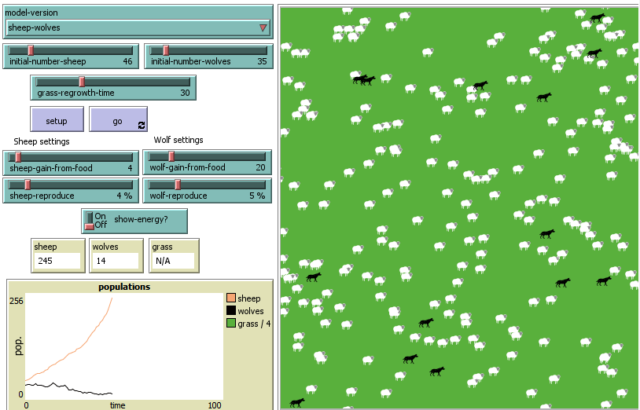
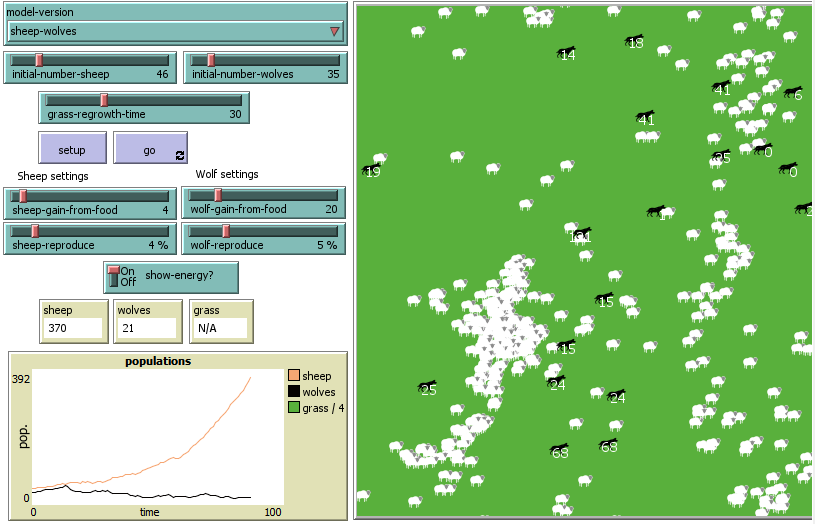
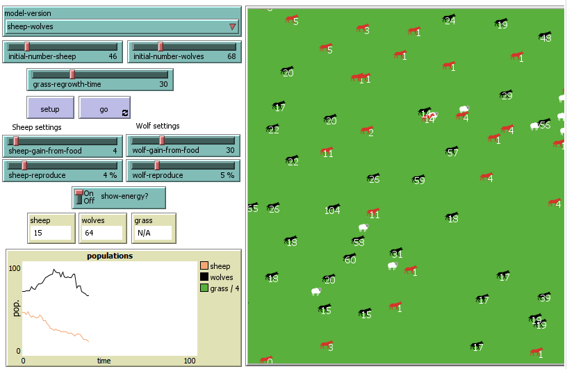

## Комп'ютерні системи імітаційного моделювання
## СПм-22-6, Соробей Богдан Володимирович
### Лабораторна робота №**2**. Редагування імітаційних моделей у середовищі NetLogo

 

### Варіант 7, Wolf Sheep Predation. Модель взаємоіснування хижаків та їх жертв. Модель у середовищі NetLogo:
[Wolf Sheep Predation](http://www.netlogoweb.org/launch#http://www.netlogoweb.org/assets/modelslib/Sample%20Models/Biology/Wolf%20Sheep%20Predation.nlogo)

Прибрати "зграйність" вовків - тепер перед початком свого ходу вовки повинні "оглядатися", перевіряючи оточення, та обирати напрямок руху виходячи з наявності вівець та відсутності інших вовків. Якщо немає іншої можливості – переміщається випадково. При знаходженні на одній ділянці поля двох вовків залишається лише один з них. Вівці переміщаються випадковим чином, але при виявленні вовка на одній із клітин поруч змінюють напрямок на протилежний.

 

Змінив процедуру **move** так, щоб вовки оглядали територію по колу на відстані 5 умовних одиниць на наявність овець та інших вовків:
Створив процедуру
<pre>
to move-w
  let nearby-sheep sheep in-radius 5                   ;  Пошук оточуючих овець в радіусі 5 одиниць
  let nearby-wolves other wolves in-radius 5           ;  Пошук оточуючих вовків у радіусі 5 одиниць
  ifelse any? nearby-sheep and not any? nearby-wolves  ;  Якщо вівці є, а вовків поруч немає
  [
    let target one-of nearby-sheep                     ;  Вибір однієї з найближчих овець як ціль
    face target                                        ; Обертання в бік вівці
    fd 2
  ]
  [
    move-random                                        ;  Рухатись у випадковому напрямку, якщо поблизу немає овець
  ]
  if any? nearby-wolves                                ;  Якщо поруч є вовки
  [
    let target one-of nearby-wolves
    face target                                        ;  Вибір одного з найближчих вовків як ціль, яку потрібно уникати
    rt 180                                             ;  Обертання в протилежну сторону від вовка
    fd 1                                               ;  Рухатись
end
</pre>

Тепер під час роботи симуляція виглядає наступним чином:

Як можна помітити - вовки тепер переміщуються або випадково або одразу за вівцями.

 

Окрім **move-w** створив ще **move-s** для руху овець за варіантом:
<pre>
to move-s
  let nearby-wolves wolves in-radius 7  ;  змінна, що містить список вовків у радіусі 7 одиниць від вівці
  ifelse any? wolves in-radius 7        ;  Перевірка, чи є вовки в радіусі 7
  [
    let target one-of nearby-wolves     ;  Якщо є вовки, виберіть одного з них як мішень
    face target
    rt 180                              ;  Обертання в протилежну сторону від вовка
    fd 1                                ;  Рухатись
  ]
  [move-random]
end
</pre>

Як можна побачити - тепер вівці бачучи попереду вовків починають тікати, а вовці намагаються оточити овець(відбувається випадково, але завжди працює).

## Внесені зміни у вихідну логіку моделі, на власний розсуд:

Зробив так, щоб вовки, у котрих мало енергії становилися червоного кольору:
<pre>
ifelse energy < 15 [
    set color red
    ][
    set color black
]
</pre>

Додав параметр віку агентам:
<pre>
age
</pre>
Зробив випадковий початковий вік від 20 до 50:
<pre>
set age 20 + random 30
</pre>
Та зробив щоб на кожному кроці вік зростав на 1:
<pre>
set age age  1
</pre>
А при збільшенні віку до 100 - смерть:
<pre>
if age > 100 [die]
</pre>

Скріншот моделі:

## Обчислювальний експеримент
### Дослідження керуючих параметрів **wolf-gain-from-food** та **wold-reproduce**
Через зроблені зміни було помічено високу смертність вовків через нестаток енергії або через вік. Тому досліджуються оптимальні значення параметрів вовків для їх виживання. З кожним набором параметрів проводиться 5 симуляцій.
Значення керуючих параметрів:
- **model-version** - sheep-wolves
- **initial-number-sheep** - 100
- **initial-number-wolves** - 50
- **sheep-gain-from-food** - 4
- **sheep-reproduce** - 4

<table>
<thead>
<tr><th>wolf-gain-from-food</th><th>wolf-reproduce</th><th>Опис</th></tr>
</thead>
<tbody>
<tr><td>10</td><td>3</td><td>В жодній з них вовки не змогли вижити з тієї або іншої причини.</td></tr>
<tr><td>30</td><td>5</td><td>4 симуляції повторили досвід минулих параметрів - вовки не вижили. Але в 1 симуляції вовки змогли досягти балансу та жити з вівцями.</td></tr>
<tr><td>50</td><td>10</td><td>У 2 симуляціях вовки з'їли настільки багато овець, що не змогли надалі бути ситим та померли. У 3 симуляціях померли так і не наздогнавши останніх овець.</td></tr>
<tr><td>75</td><td>15</td><td>У всіх симуляціях вовки надто швидко народжувалися та з'ївши усіх овець помирали.</td></tr>
<tr><td>2</td><td>2</td><td>З такими параметрами вовки змогли вижити 4 з 5 симуляцій та жити разом з вівцями. Томму ці параметри було вирішено залишити найоптимальнішими.</td></tr>
</tbody>
</table>
