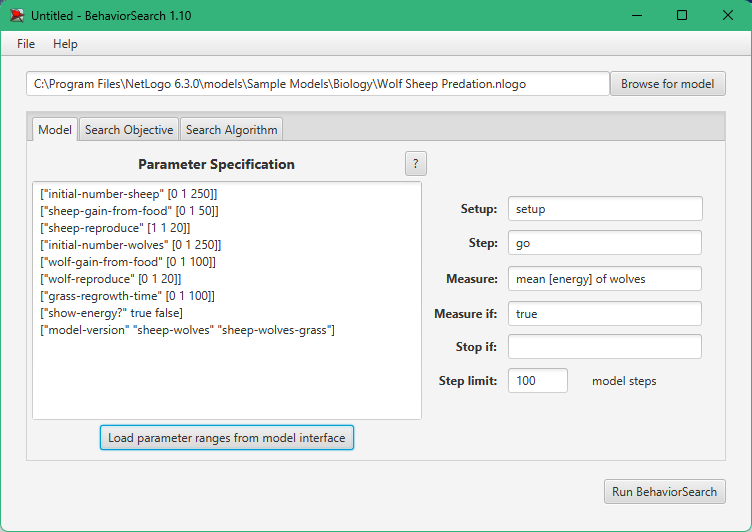
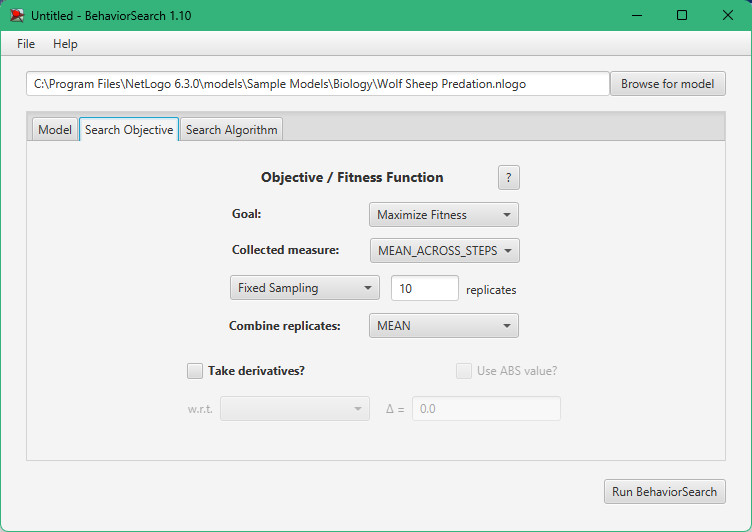
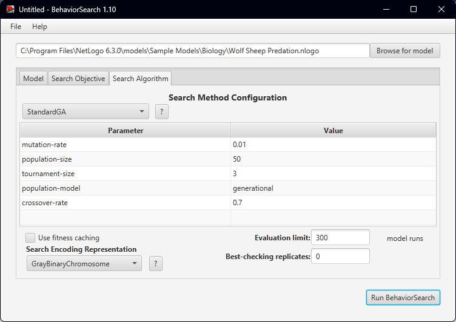
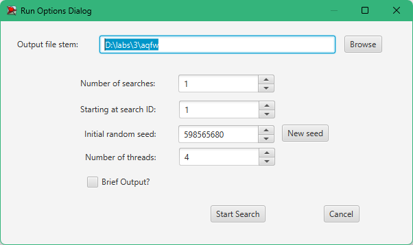
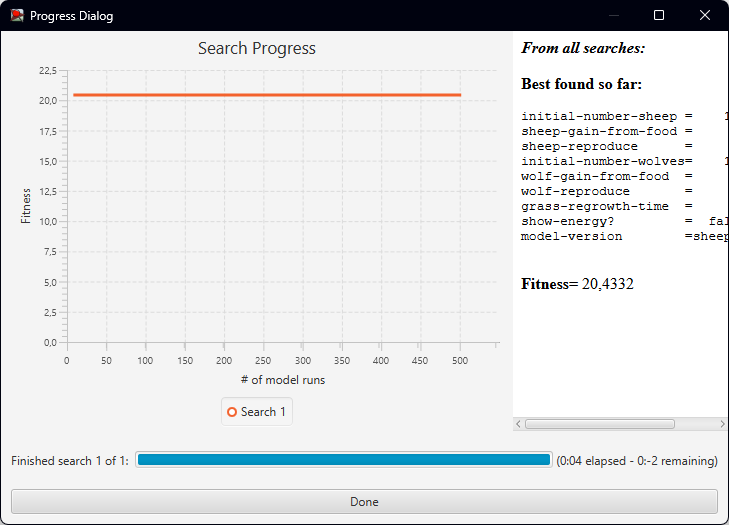
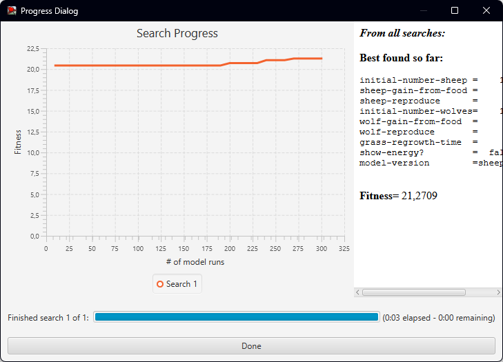

## Комп'ютерні системи імітаційного моделювання
## СПм-22-6, **Соробей Богдан Володимирович**
### Лабораторна робота №**3**. Використання засобів обчислювального интелекту для оптимізації імітаційних моделей

 

### Варіант 7, Wolf Sheep Predation. Модель взаємоіснування хижаків та їх жертв. Модель у середовищі NetLogo:
[Wolf Sheep Predation](http://www.netlogoweb.org/launch#http://www.netlogoweb.org/assets/modelslib/Sample%20Models/Biology/Wolf%20Sheep%20Predation.nlogo)

 

## Вербальний опис моделі:
Дана модель досліджує стабільність екосистеми «хижак-жертва». Система вважається нестабільною, якщо в ній спостерігається тенденція до вимирання одного чи кількох видів. З іншого боку, стабільна система прагне забезпечити своє існування протягом тривалого часу, незалежно від коливань чисельності населення.

### Є два основних сценарії цієї моделі:
У першому сценарії, відомому як «вівці-вовки», вовки та вівці випадково блукають ландшафтом, а вовки шукають овець для поласування. Кожен крок вимагає вовків витрачати енергію, і вони повинні поїдати овець для відновлення своєї енергії. Якщо у вовків закінчується енергія, вони гинуть. Щоб забезпечити стійкість популяції, кожен вовк чи вівця має фіксовану ймовірність розмноження на кожному кроці часу. Цей сценарій моделює траву як «нескінченну», щоб завжди забезпечувати вівцям достатню їжу, і не враховує поїдання чи вирощування трави. Таким чином, вівці не витрачають енергію під час їжі чи руху. Ця варіація створює цікаву динаміку популяції, але в кінцевому підсумку є нестабільною. Вона особливо підходить для взаємодії видів у багатому живильному середовищі, таких як два штами бактерій у чашці Петрі.

У другому сценарії, версії «вівці-вовки-трава», окрім вовків і овець, явно моделюється трава (зелена). Поведінка вовків ідентична першому сценарію, але цього разу вівці повинні поїдати траву для збереження своєї енергії - коли вони вичерпують запаси енергії, вони гинуть. Після вживання трави, вона відростає лише через певний проміжок часу. Ця варіація складніша, але в цілому стабільна. Вона наближена до класичних моделей коливань населення Лотки-Вольтерра. Хоча класичні моделі Лотки-Вольтерра передбачають можливість набування популяціями реальних значень, в невеликих популяціях ці моделі недооцінюють вимирання. Моделі, засновані на агентах, подібні до наведених тут, надають більш реалістичні результати.

### Керуючі параметри:
- **model-version** - вибір версії моделі.
- **initial-number-sheep** - початкова кількість овець.
- **initial-number-wolves** - початкова кількість вовків.
- **grass-regrowth-time** - інтервал часу, необхідний для відростання трави після її з’їдання.
- **sheep-gain-from-food** - кількість енергії, яку вівці отримують за кожну з’їдену травинку.
- **wolf-gain-from-food** - кількість енергії, яку вовки отримують за кожну з’їдену вівцю.
- **sheep-reproduce** - ймовірність розмноження вівця на кожному кроці часу.
- **wolf-reproduce** - ймовірність розмноження вовка на кожному кроці часу.

### Параметри візуалізації:
- **show-energy** - вказує, чи відображати енергію кожної тварини у вигляді числового значення.

### Показники роботи системи:
- **sheep** - теперішня кількість овець.
- **wolves** - теперішня кількість вовків.
- **grass** - теперішня кількість трави.
- **populations** - графік, який відображає значення параметрів **sheep**, **wolves** та **grass**.

### Налаштування середовища BehaviorSearch:

**Обрана модель**:
<pre>
C:\Program Files\NetLogo 6.3.0\models\Sample Models\Biology\Wolf Sheep Predation.nlogo
</pre>
**Параметри моделі** (вкладка Model):  
*Параметри та їх можливі діапазони були **автоматично** вилучені середовищем BehaviorSearch із вибраної імітаційної моделі, для цього є кнопка «Завантажити діапазони параметрів із інтерфейсу моделі»*:
<pre>
["initial-number-sheep" [0 1 250]]
["sheep-gain-from-food" [0 1 50]]
["sheep-reproduce" [1 1 20]]
["initial-number-wolves" [0 1 250]]
["wolf-gain-from-food" [0 1 100]]
["wolf-reproduce" [0 1 20]]
["grass-regrowth-time" [0 1 100]]
["show-energy?" true]
["model-version" "sheep-wolves"]
</pre>
Використовувана **міра**:  
Для фітнес-функції було обрано **значення кількості вовків** та вказано у параметрі "**Measure**":
<pre>
mean [energy] of wolves
</pre>

Загальний вигляд вкладки налаштувань параметрів моделі: 

**Налаштування цільової функції** (вкладка Search Objective):  
Метою підбору параметрів імітаційної моделі, є **максимізація** значення середньої кількості енергії у вовків – це вказано через параметр "**Goal**" зі значенням **Maximize Fitness**. Тобто необхідно визначити такі параметри налаштувань моделі, у яких максимальна кількість енергії.
Загальний вигляд вкладки налаштувань цільової функції: 

**Налаштування алгоритму пошуку** (вкладка Search Algorithm):  
Загальний вид вкладки налаштувань алгоритму пошуку:  

 

### Результати використання BehaviorSearch:
Діалогове вікно виглядало настпуним чином:

Результат пошуку параметрів імітаційної моделі, використовуючи **генетичний алгоритм**:

Результат пошуку параметрів імітаційної моделі, використовуючи **випадковий пошук**:  

 
